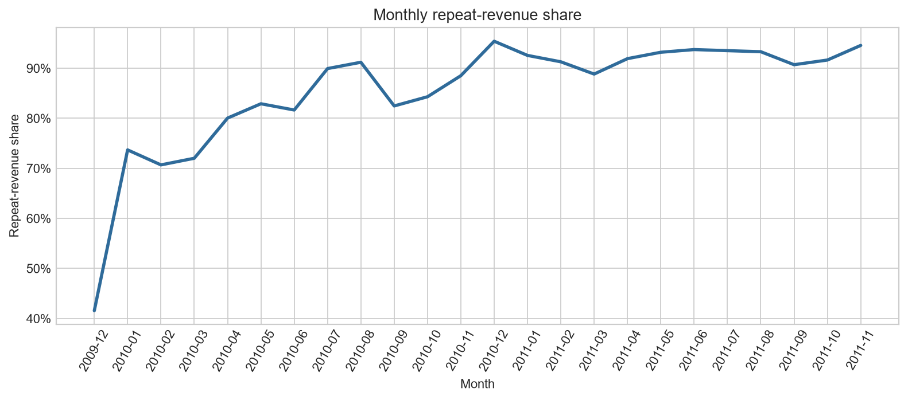
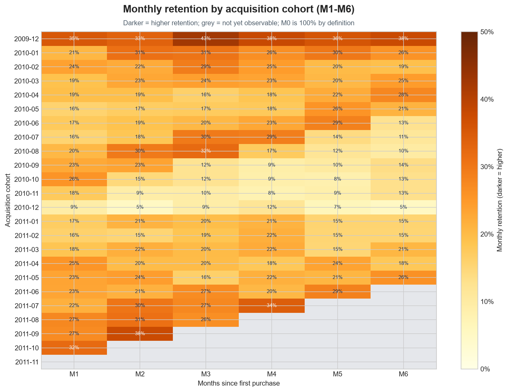
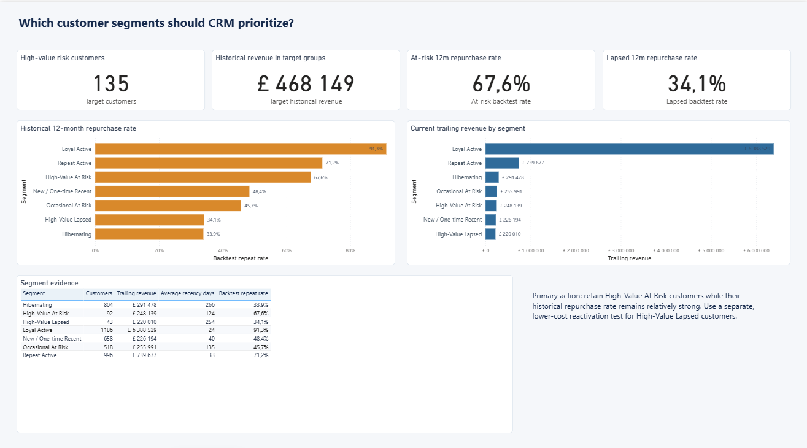
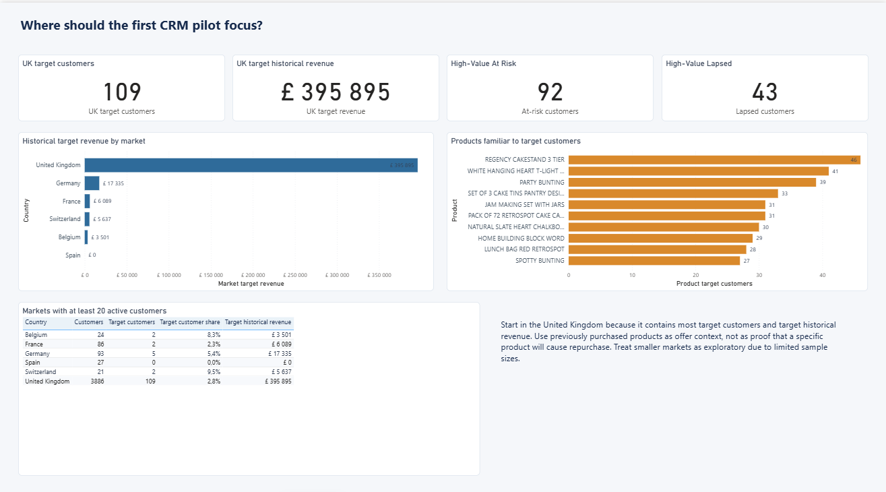

# Online Retail Retention Analysis

## Business question

**Which customers and markets should CRM prioritize to protect repeat revenue?**

The analysis follows one decision path:

1. measure how dependent revenue is on repeat purchasing;
2. check whether customers return after their first purchase;
3. backtest customer segments on a later 12-month period;
4. identify current high-value risk groups;
5. choose a practical market for the first CRM pilot.

## Answer

- Repeat orders generate **85.8% of observed revenue**, so customer retention is commercially important.
- Weighted monthly cohort retention is **23.4% at M1** and **22.1% at M6**. Repeat revenue is strong, but only a minority of each cohort purchases in a given later month.
- The current portfolio contains **92 High-Value At Risk** and **43 High-Value Lapsed** customers, with **£468k of trailing historical revenue** between them.
- In the historical backtest, **67.6%** of High-Value At Risk customers purchased during the next 12 months. The comparable rate for High-Value Lapsed customers was **34.1%**.
- The first pilot should focus on the **United Kingdom**: it contains **109 of 135 target customers** and **£396k of target historical revenue**.

These values describe observed history. They are not a forecast of campaign uplift.



## Analysis workflow

### 1. Data and scope

The project uses the [UCI Online Retail II dataset](https://archive.ics.uci.edu/dataset/502/online+retail+ii), containing UK-based online retail transactions from December 2009 to December 2011.

December 2011 is incomplete, so performance analysis ends on **30 November 2011**.

| Stage | Rows |
|---|---:|
| Raw source | 1,067,371 |
| After exact deduplication | 1,033,036 |
| After requiring Customer ID | 797,885 |
| After excluding cancellations | 779,495 |
| Analysis-ready rows | 779,425 |

The cleaned dataset keeps completed purchases with a known customer, positive quantity, positive price, and a valid date.

```python
clean = raw.drop_duplicates()
clean = clean[clean["customer_id"].notna()]
clean = clean[~clean["invoice_id"].str.startswith("C")]
clean = clean[(clean["quantity"] > 0) & (clean["unit_price"] > 0)]
clean["line_revenue"] = clean["quantity"] * clean["unit_price"]
```

### 2. Build an order-level table

The source is at product-line level. The first SQL step combines product lines into one row per order.

```sql
SELECT
    invoice_id,
    customer_id,
    invoice_ts,
    country,
    SUM(quantity) AS units,
    SUM(line_revenue) AS order_revenue
FROM transactions_clean
WHERE invoice_ts < '2011-12-01'
GROUP BY invoice_id, customer_id, invoice_ts, country;
```

This produces **36,255 orders from 5,850 customers**.

`Invoice` is not globally unique across the two source sheets. The project therefore uses `invoice_id + customer_id + invoice_ts` as the order key.

### 3. Measure repeat-revenue health

Orders are numbered separately for each customer. Order 1 is the acquisition order; orders 2 and later are repeat orders.

```sql
SELECT
    SUM(order_revenue) AS revenue,
    SUM(CASE WHEN customer_order_number > 1
             THEN order_revenue ELSE 0 END) AS repeat_revenue
FROM fact_orders_enriched;
```

| Metric | Result |
|---|---:|
| Revenue | £16.86m |
| Repeat revenue | £14.46m |
| Repeat-revenue share | 85.8% |

**Interpretation:** existing customers account for most recorded revenue, which makes retention a useful CRM objective.

### 4. Check cohort retention

Customers are grouped by first purchase month. Retention is the share of a cohort active in a specific later month.

```sql
SELECT
    month_number,
    SUM(retained_customers) * 1.0 / SUM(cohort_size)
        AS weighted_retention_rate
FROM cohort_retention
WHERE month_number IN (1, 3, 6)
GROUP BY month_number;
```

| Horizon | Weighted retention |
|---|---:|
| M1 | 23.4% |
| M3 | 24.9% |
| M6 | 22.1% |

M3 can be higher than M1 because this is monthly activity, not cumulative survival: a customer may skip month 1 and return in month 3. Only cohorts with enough observation time are included at each horizon.



Darker cells indicate higher monthly retention. Grey cells are periods that newer cohorts had not yet reached; M0 is omitted because it is 100% by definition and would flatten the useful M1-M6 color differences.

### 5. Backtest the segment logic

The segmentation is tested before it is used for the current portfolio.

- **Feature window:** 1 Dec 2009–30 Nov 2010
- **Outcome window:** 1 Dec 2010–30 Nov 2011
- **Outcome:** at least one purchase in the next 12 months

The rules use recency, order frequency, and the top monetary quartile. They stay deliberately simple so a CRM manager can reproduce them.

```sql
CASE
    WHEN recency_days <= 90
         AND (frequency_orders >= 5 OR monetary_quartile = 4)
        THEN 'Loyal Active'
    WHEN recency_days <= 180
         AND (frequency_orders >= 5 OR monetary_quartile = 4)
        THEN 'High-Value At Risk'
    WHEN frequency_orders >= 5 OR monetary_quartile = 4
        THEN 'High-Value Lapsed'
    ELSE 'Other'
END
```

| Segment | Customers in backtest | Purchased in next 12m |
|---|---:|---:|
| Loyal Active | 1,215 | 91.3% |
| Repeat Active | 1,025 | 71.2% |
| High-Value At Risk | 108 | 67.6% |
| New / One-time Recent | 637 | 48.4% |
| Occasional At Risk | 494 | 45.7% |
| High-Value Lapsed | 44 | 34.1% |
| Hibernating | 743 | 33.9% |

The backtest does not prove that a campaign will cause a repeat purchase. It shows that the selected risk groups were still commercially addressable in historical data.

### 6. Apply the rules to the current portfolio

The same rules are applied to purchases from **1 Dec 2010 to 30 Nov 2011**.

```sql
CASE
    WHEN recency_days <= 90 AND (frequency_orders >= 5 OR monetary_quartile = 4)
        THEN 'Loyal Active'
    WHEN recency_days <= 90 AND frequency_orders >= 2
        THEN 'Repeat Active'
    WHEN recency_days <= 90
        THEN 'New / One-time Recent'
    WHEN recency_days <= 180
         AND (frequency_orders >= 5 OR monetary_quartile = 4)
        THEN 'High-Value At Risk'
    WHEN recency_days <= 180
        THEN 'Occasional At Risk'
    WHEN frequency_orders >= 5 OR monetary_quartile = 4
        THEN 'High-Value Lapsed'
    ELSE 'Hibernating'
END AS rfm_segment
```



The primary retention group is **High-Value At Risk**: 92 customers, £248k trailing revenue, and a relatively strong 67.6% historical next-12-month purchase rate.

The secondary reactivation group is **High-Value Lapsed**: 43 customers and £220k trailing revenue. Its historical rate is lower, so it should use a separate, lower-cost test.

### 7. Choose the first market and offer context

```sql
SELECT
    primary_country,
    COUNT(*) AS target_customers,
    SUM(monetary_revenue) AS target_historical_revenue
FROM rfm_current
WHERE rfm_segment IN ('High-Value At Risk', 'High-Value Lapsed')
GROUP BY primary_country
ORDER BY target_historical_revenue DESC;
```

The United Kingdom has enough target customers for a practical pilot. Other markets contain very small target samples and should be treated as exploratory.

Previously purchased products can be used to make messages relevant. They are offer context, not evidence that a product will cause reactivation.



## Recommendation

Run two controlled CRM tests in the United Kingdom:

1. a retention test for High-Value At Risk customers;
2. a lower-cost reactivation test for High-Value Lapsed customers.

Use a holdout group and measure:

- primary KPI: repeat purchase rate within the agreed follow-up window;
- value KPI: incremental revenue per contacted customer;
- guardrails: discount cost, unsubscribe rate, and margin if margin data becomes available.

Do not report the £468k historical revenue as expected campaign revenue. Campaign value must be measured against the holdout after launch.

## Limitations

- Customer IDs are missing from 22.8% of raw rows; customer analysis cannot use those transactions.
- December 2011 is incomplete and excluded from performance metrics.
- The top 1% of orders account for 16.3% of revenue, so the portfolio contains large wholesale-like purchases.
- The dataset contains transactions, not marketing exposure, margin, channel cost, or customer consent.
- Segment backtesting shows association, not causal campaign impact.

## Repository structure

```text
notebooks/analysis.ipynb       executed walkthrough with SQL, tables and charts
sql/01_create_model.sql        analytical tables and segment logic
sql/02_analysis_queries.sql    short queries used in the case
powerbi/project/               editable Power BI Project (PBIP)
powerbi/screenshots/           dashboard pages for GitHub
data/powerbi/                  small prepared files used by Power BI
outputs/validation_report.md   calculation and structural checks
scripts/                       reproducible build scripts
```

## Reproduce

To open the report, open `powerbi/project/RetentionAnalysis.pbip` in Power BI Desktop. The committed project uses a placeholder `DataFolder` path for portability. After cloning or downloading the repository, set `DataFolder` to the full local path of `data/powerbi` and select **Refresh**.

To rebuild from the official source:

```bash
python scripts/download_data.py
python scripts/build_analysis.py
python scripts/build_notebook.py
python scripts/build_powerbi_project.py
python scripts/validate_project.py
```

## Data and tools

Dataset: [UCI Online Retail II](https://archive.ics.uci.edu/dataset/502/online+retail+ii). Tools: SQL (SQLite), Python, Jupyter Notebook, and Power BI.
